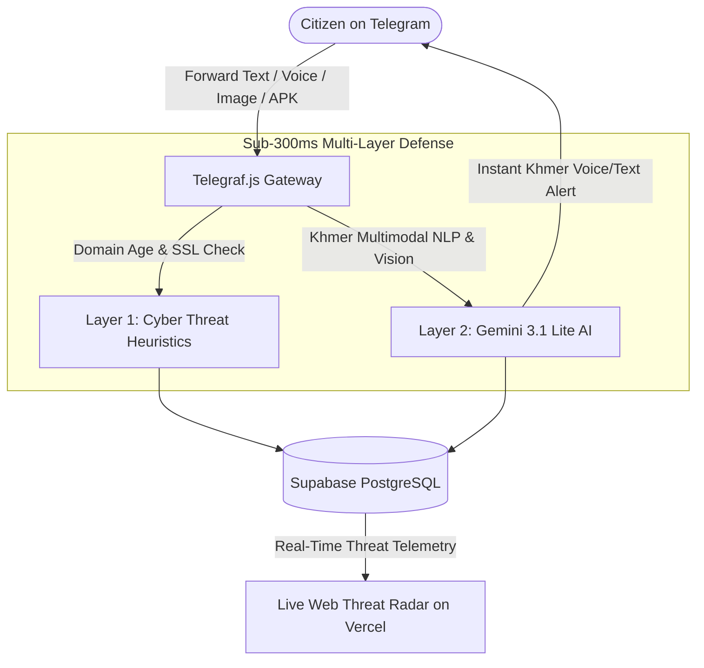

<p align="center">
  
</p>

<h1 align="center">🛡️ KROH (ក្រោះ) — The Digital Armor</h1>
<h3 align="center">Autonomous Multimodal Anti-Scam Shield for Cambodian Citizens</h3>

<p align="center">
  <em>Built by <strong>Team CHBAS (ច្បាស់ ច្បាស់)</strong> for the <strong>AUPP - ITM Innovation Hackathon 2026</strong></em>
</p>

<p align="center">
  <a href="https://my-idea-for-hackathon.vercel.app"></a>
  
  
  
</p>

---

## ⚡ The 30-Second Overview
**KROH (ក្រោះ)** is an autonomous Telegram bot and live community threat radar that protects 17 million Cambodians from digital financial scams, fake loan bots, cloned bank login links (`aba-login.top`), and social engineering voice notes in **less than 300 milliseconds**.

Citizens forward any suspicious message, URL, screenshot, voice note, or APK directly to `@KrohShieldBot` on Telegram and receive an instant, authoritative verdict in colloquial Khmer and English.

---

## 🎯 5 Core Attack Vectors Handled

```
┌─────────────────────────────────────────────────────────────────────────────┐
│ 1. 🔗 Phishing URLs       -> Scans fake bank domains (.top, .cc) & homoglyphs│
│ 2. 📸 Fake Screenshots   -> Gemini 3.1 Lite OCR extracts fake receipts/SMS  │
│ 3. 🎙️ Voice Notes         -> Native audio understanding flags social fraud   │
│ 4. 📱 Malicious APKs      -> Hash lookup against known malware registries    │
│ 5. 🏁 KHQR Quishing       -> Detects malicious redirects on physical QR codes │
└─────────────────────────────────────────────────────────────────────────────┘
```

---

## 🏛️ System Architecture



---

## 📚 Complete Project Documentation

| Document | Description |
| :--- | :--- |
| 📄 **[`STARTUP_PACK_KROH.md`](./STARTUP_PACK_KROH.md)** | Master Startup Documentation Pack: Founder Brief (G0), ICP & JTBD, PRD, B2B Banking API Business Model, Risk Register, and 90-Day Execution Roadmap. |
| 🌐 **[`index.html`](./index.html)** | Interactive 6-slide bilingual presentation deck with 12 deep-dive modals comparing top Cambodian innovation tracks. |
| 🧠 **[`context/AGENT.md`](./context/AGENT.md)** | Master Cognitive Brain & Tier-3 context contract for Team CHBAS. |
| 👤 **[`context/USER.md`](./context/USER.md)** | Operator profile & engineering standards for Christpor Rin. |

---

## 👥 Team CHBAS (ច្បាស់ ច្បាស់) Roster

| Member | Role | Primary Hackathon Responsibility |
| :--- | :--- | :--- |
| **Christpor Rin** | **AI Engineer & Team Lead** | Gemini 3.1 Lite Agent Prompting, Telegram Webhooks, Web UI & Pitch Delivery. |
| **Teammate 1** | **Data Science Specialist** | Cambodian Scam NLP, Feature Engineering & Scam Keyword Datasets. |
| **Teammate 2** | **Data Science & ML Engineer** | 0–100% Threat Risk Scoring Algorithm & Campaign Cluster Visualizations. |
| **Teammate 3** | **Software Engineer** | Supabase Database, Backend REST APIs & Domain Threat Heuristics. |

---

## 🛠️ Quick Start & Local Development

```bash
# Clone the private repository
git clone https://github.com/christpor/kroh-ai-hackathon.git
cd kroh-ai-hackathon

# Serve the interactive presentation locally
python3 -m http.server 3333

# Open in your browser
open http://localhost:3333
```

---

## ⚖️ License & Confidentiality
© 2026 **Team CHBAS (Christpor Rin & Co.)**. All rights reserved.  
*Proprietary project engineered for the AUPP - ITM Innovation Hackathon 2026.*
