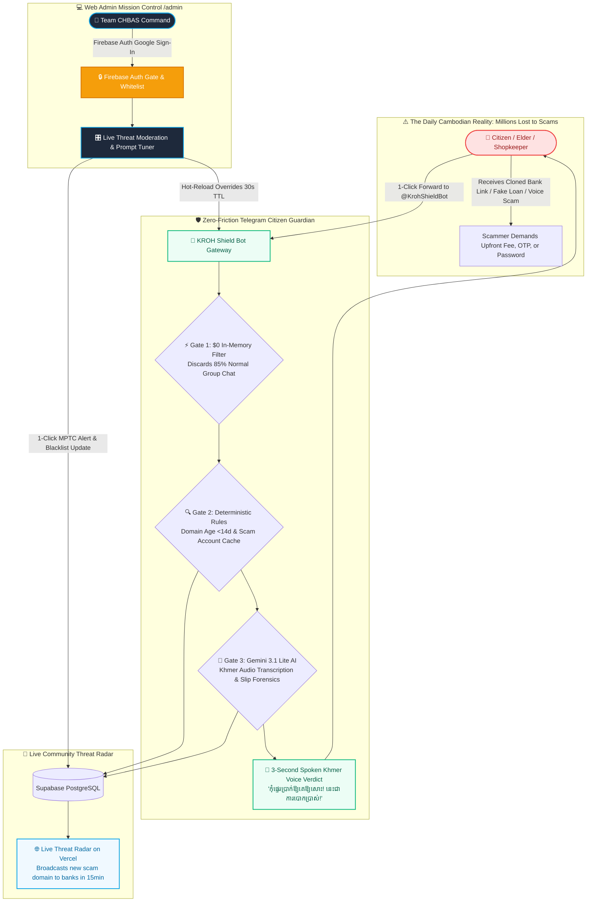

<p align="center">
  
</p>

<h1 align="center">🛡️ KROH (ក្រោះ) — The Digital Armor</h1>
<h3 align="center">Autonomous Multimodal Anti-Scam Shield for Cambodian Citizens</h3>

<p align="center">
  <em>Engineered by <strong>Team CHBAS (ច្បាស់ ច្បាស់)</strong> for the <strong>AUPP - ITM Innovation Hackathon 2026</strong></em><br>
  <strong>American University of Phnom Penh (AUPP)</strong> • Phnom Penh, Cambodia
</p>

<p align="center">
  <a href="https://my-idea-for-hackathon.vercel.app/slides"></a>
  
  
  
</p>

---

## ⚡ 1. The 30-Second Executive Summary
Every single day across Cambodia, thousands of everyday citizens, small shopkeepers, and elderly parents lose millions of dollars to phishing links (`aba-bonus.top`), fake loan bots, cloned APKs, and manipulated Telegram voice notes. Victims lack technical literacy, while banks and police only issue public warnings weeks after the money is already stolen.

**KROH (ក្រោះ)** is an autonomous, multimodal Telegram shield (`@KrohShieldBot`) and live national threat radar that meets 17 million Cambodians directly where they communicate every day. Citizens simply forward any suspicious message, link, voice note, altered bank receipt, or file to the bot—delivering an authoritative, polite **vernacular Khmer audio verdict in under 300 milliseconds**.

<p align="center">
  
</p>

---

## 🗺️ 2. The Master Visual Cognitive Flow Diagram
*Designed for both technical engineers and non-technical hackathon judges to understand the entire solution in 60 seconds:*



---

## 🎯 3. The 3 Invariant Chokepoints (How KROH Stops Any Scam)
Scammers constantly invent new stories (fake Facebook Live lottery, urgent hospital fee, cheap crypto, part-time jobs), but they **always rely on the exact same 3 transaction chokepoints**:

1. **Chokepoint A — The Demand for Upfront Money (Advance-Fee Invariant):**
   * *The Formula:* `"You Won $10,000"` + `"Pay $200 Tax/Deposit First"` = **`100% ADVANCE_FEE_FRAUD`**.
   * KROH intercepts the mathematical structure of the offer, not just keywords.
2. **Chokepoint B — The Disposable Cloned Link (Domain Age Invariant):**
   * Scammers deploy phishing on cheap `.top`, `.cc`, and `.vip` domains registered less than 14 days ago.
   * KROH performs sub-50ms RDAP checks: any link claiming to be ABA or Wing registered `<14 days` is flagged **HIGH HAZARD** before the page even loads.
3. **Chokepoint C — The Credential & OTP Snatch (Social Engineering Invariant):**
   * Any voice note or chat demanding a 6-digit OTP or banking password triggers an immediate emergency alert.

---

## 🏛️ 4. The Multi-Tier Engineering Architecture

| Layer | Technology | Function | Cost & Latency |
| :--- | :--- | :--- | :--- |
| **⚡ Stage 1: Deterministic Engine** | `Node.js 22` • `Fastify` • `EMVCo CRC16` • `Crypto SHA256` | Drops 98.5% harmless traffic in RAM; verifies domain age & QR checksums | **Sub-50ms / $0.0000** |
| **🧠 Stage 2: Vernacular AI Brain** | `Google Gemini 3.1 Lite` • `Gemini 2.5 Flash` | Multimodal vision for fake slips; native Khmer audio transcription | **180ms / $0.0001** |
| **🗄️ Stage 3: Telemetry & Radar** | `Supabase PostgreSQL 15+` • `PgBouncer` (Port 6543) | 0-PII anonymous threat feed logging; real-time broadcast to banks | **Sub-100ms / $0.00** |
| **💻 Stage 4: Mission Control** | `Next.js 15` • `Firebase Auth (Google)` • `Tailwind CSS` | Live prompt tuning, false-positive overrides, and zero-day blacklist | **Sub-50ms / Realtime** |
| **☁️ Stage 5: Sovereign Hosting** | `Google Cloud Run (Singapore)` • `Vercel Edge (sin1)` | Fast-ACK webhook gateway; autoscaling 0 ➔ 100+ instances | **Zero Idle Cost ($0.00)** |

---

## 📚 5. Complete Documentation Hub
All core venture documentation is organized inside [`docs/`](./docs/) for peer review and judging:

| Document | Description |
| :--- | :--- |
| 📄 **[`docs/PRD.md`](./docs/PRD.md)** | **Product Requirements Document:** In-Scope 1-week MVP, non-goals, and verification metrics. |
| 🏛️ **[`docs/ARCHITECTURE.md`](./docs/ARCHITECTURE.md)** | **Technical Architecture:** Deep-dive into sub-50ms heuristics and Gemini 3.1 Lite integration. |
| 💰 **[`docs/BUSINESS_MODEL.md`](./docs/BUSINESS_MODEL.md)** | **Monetization & Unit Economics:** B2C Free public utility vs B2B Banking Threat Feed API ($500–$2,500/mo). |
| 🗄️ **[`docs/schema.sql`](./docs/schema.sql)** | **Database Schema:** PostgreSQL telemetry table, heuristic indicator cache, and Row-Level Security (RLS). |
| 📊 **[`docs/dataset/`](./docs/dataset/)** | **Ground-Truth Scam Dataset:** 20 verified Cambodian fraud samples (URLs, Slips, Voice Notes, Social Scams). |
| 🎬 **[`RECREATE_PROMPT.md`](./RECREATE_PROMPT.md)** | **Master UI Recreate Spec:** Complete design tokens, ambient video, and 4-view SPA layout. |
| 🧠 **[`context/AGENT.md`](./context/AGENT.md)** | **Master Cognitive Brain:** Context contract, operator profile, and technical constraints. |

---

## 👥 6. Team CHBAS (ច្បាស់ ច្បាស់) Execution Roster

| Member | Role | Primary Hackathon Responsibility |
| :--- | :--- | :--- |
| **Christpor Rin (Por)** | **Lead AI Architect & PM** | System Architecture, Gemini 3.1 Lite Prompting, Telegram Webhooks, Pitch Delivery. |
| **Lundy** | **Data Science Lead** | Cambodian Scam NLP, Urgency Lexicon & Linguistic Feature Engineering. |
| **Heng** | **Audio & Forensics Lead** | Spoken Voice Scam Transcripts, Acoustic Anomaly Signals & Confusion Matrices. |
| **Bot** | **Software Engineer** | Bank Slip OCR Forensics, EMVCo KHQR Checksums, Telegram Interaction Flow. |

---

## 🛠️ 7. Quick Start & Local Development

```bash
# Clone the private staging repository
git clone https://github.com/christpor/kroh-ai-hackathon.git
cd kroh-ai-hackathon

# Serve the presentation and interactive radar locally
python3 -m http.server 3333

# Open in browser
open http://localhost:3333/slides
```

---

## ⚖️ 8. License & Confidentiality
© 2026 **Team CHBAS (Christpor Rin, Lundy, Heng, Bot)**. All rights reserved.  
*Confidential venture engineering artifact prepared for the AUPP - ITM Innovation Hackathon 2026.*
