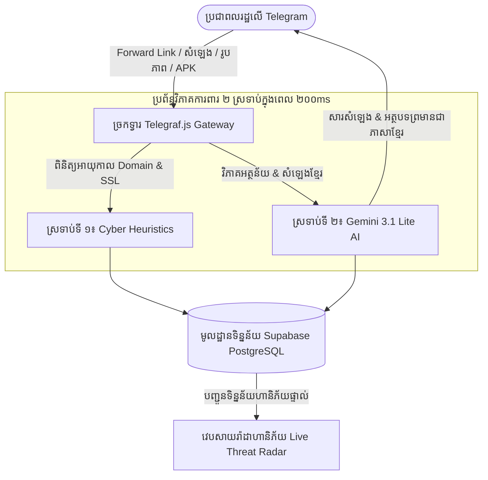

# 🛡️ ឯកសារយុទ្ធសាស្ត្រស្តាតអាប់ & ផែនការស្ថាបនិក៖ KROH (ក្រោះ)
> **ប្រព័ន្ធ AI ស្វ័យប្រវត្តិកម្ចាត់សារបោកប្រាស់ក្នុងពេលជាក់ស្តែងសម្រាប់ពលរដ្ឋកម្ពុជា**  
> **ឈ្មោះក្រុម៖** Team CHBAS (ច្បាស់ ច្បាស់)  
> **ស្ថាបត្យករដឹកនាំ & ប្រធានគម្រោង (PM):** Christpor Rin (AI Engineer & Team Lead)  
> **កម្មវិធីប្រកួត៖** AUPP - ITM Innovation Hackathon 2026 (សាកលវិទ្យាល័យអាមេរិកាំងភ្នំពេញ)  
> **ស្តង់ដាររៀបចំ៖** Startup Documentation Auditor & Planner v3.4 (`startup-documentation-auditor`)  
> **កាលបរិច្ឆេទ៖** ខែសីហា ឆ្នាំ២០២៦  

---

## 📌 ផ្នែកទី ១៖ សេចក្តីសង្ខេបស្ថាបនិក (FOUNDER VENTURE BRIEF - G0 GATE)

### ១.១ សេចក្តីថ្លែងការណ៍បេសកកម្ម ១ ប្រយោគ (One-Sentence Venture Statement)
> **« KROH (ក្រោះ) គឺជាប្រព័ន្ធ AI ការពារសុវត្ថិភាពឌីជីថលពហុមធ្យោបាយ (Multimodal) តាមតេឡេក្រាម និងរ៉ាដាព្រមានហានិភ័យសហគមន៍ផ្ទាល់ ដែលការពារពលរដ្ឋកម្ពុជា ១៧ លាននាក់ពីការបោកប្រាស់ហិរញ្ញវត្ថុ កម្ចីក្លែងក្លាយ និង Link លួចគណនីធនាគារ ដោយឆ្លើយតបជាភាសាខ្មែរភ្លាមៗក្នុងពេលក្រោម ៣០០ មីលីវិនាទី។ »**

### ១.២ សង្ខេបបញ្ហាស្នូល និងដំណោះស្រាយឌីជីថល (Core Problem & Solution)
- **បញ្ហាប្រឈមជាក់ស្តែង (Core Problem)៖** រៀងរាល់ថ្ងៃនៅកម្ពុជា ប្រជាពលរដ្ឋរាប់ពាន់នាក់បានបាត់បង់ប្រាក់សន្សំរាប់លានដុល្លារ ដោយសារល្បិចបោកប្រាស់តាម Link ក្លែងក្លាយ (`aba-bonus.top`), Bot កម្ចីប្រាក់រហ័ស, កម្មវិធី APK មេរោគ, និងសារសំឡេងបោកបញ្ឆោតតាម Telegram, Facebook និង SMS។ ពលរដ្ឋទូទៅខ្វះចំណេះដឹងបច្ចេកវិទ្យាដើម្បីផ្ទៀងផ្ទាត់ ចំណែកធនាគារ និងសមត្ថកិច្ចច្រើនតែចេញសេចក្តីព្រមានយឺតយ៉ាវ ក្រោយពេលប្រជាជនចាញ់បោកអស់ប្រាក់ទៅហើយ។
- **ដំណោះស្រាយឌីជីថល (Digital Solution)៖** បង្កើត Telegram Bot ដែលមិនទាមទារការដំឡើងកម្មវិធីថ្មី (Zero-Installation) ភ្ជាប់ជាមួយវេបសាយរ៉ាដាហានិភ័យសាធារណៈ។ នៅពេលពលរដ្ឋទទួលបានសារ Link, សំឡេង, រូបភាព Screenshot ឬ File សង្ស័យ ពួកគាត់គ្រាន់តែ **Forward ចូលទៅកាន់ KROH Bot** — ប្រព័ន្ធ AI **Gemini 3.1 Lite** រួមជាមួយក្បួនត្រួតពិនិត្យ Cyber Heuristics នឹងផ្តល់លទ្ធផលវិនិច្ឆ័យយ៉ាងច្បាស់លាស់ សុភាពរាបសារ និងផ្លូវការជាភាសាខ្មែរក្នុងពេលត្រឹមតែ **២០០ មីលីវិនាទី**។

### ១.៣ អត្ថប្រយោជន៍ប្រកួតប្រជែងផ្តាច់មុខ (The Unfair Moat)
1. **AI យល់ដឹងភាសាខ្មែរ និងបរិបទក្នុងស្រុក (Khmer Vernacular Multimodal AI)៖** ប្រព័ន្ធសុវត្ថិភាពអន្តរជាតិ (ដូចជា Cloudflare, VirusTotal, Google Safe Browsing) អាចស្កេនបានតែអក្សរអង់គ្លេសលើ Browser កុំព្យូទ័រ។ ប៉ុន្តែ KROH ត្រូវបានរចនាឡើងយ៉ាងពិសេសសម្រាប់ **វិភាគសំឡេងនិយាយភាសាខ្មែរ, អានអក្សរខ្មែរលើរូបភាព (OCR) និងស្គាល់ទម្រង់វិក្កយបត្រធនាគារក្នុងស្រុក (Bakong, ABA, Wing, ACLEDA)**។
2. **ដំណើរការផ្ទាល់លើ Telegram គ្មានភាពស្មុគស្មាញ (Zero-Friction Telegram Native)៖** ជាង ៩០% នៃការប្រាស្រ័យទាក់ទងនៅកម្ពុជាធ្វើឡើងលើ Telegram។ KROH ជួយពលរដ្ឋដល់ទីកន្លែងដែលពួកគាត់កំពុងរស់នៅ ដោយមិនចាំបាច់ឱ្យពួកគាត់ទៅទាញយក App ថ្មី ឬចុះឈ្មោះបង្កើត Account ពិបាកៗនោះឡើយ។
3. **រ៉ាដាសហគមន៍ប្រឆាំងការបោកប្រាស់ទូទាំងប្រទេស (National Threat Radar)៖** រាល់ Link ឬលេខទូរស័ព្ទបោកប្រាស់ដែលត្រូវបានចាប់បាន នឹងត្រូវផ្សាយផ្ទាល់លើផែនទីរ៉ាដាសាធារណៈភ្លាមៗ ដើម្បីប្រែក្លាយការការពារបុគ្គលម្នាក់ ឱ្យទៅជាខែលការពារសហគមន៍ទូទាំងប្រទេសកម្ពុជា។

---

## 📊 ផ្នែកទី ២៖ បញ្ជីភស្តុតាង និងប្រភពផ្លូវការ (EVIDENCE LEDGER)

| ទិន្នន័យ / ភស្តុតាង | ការពិតជាក់ស្តែងដែលបានផ្ទៀងផ្ទាត់ | ប្រភពឯកសារយោងផ្លូវការ | កម្រិតទំនុកចិត្ត |
| :--- | :--- | :--- | :--- |
| **សន្និសីទអន្តរជាតិប្រឆាំងការបោកប្រាស់** | កម្ពុជាធ្វើជាម្ចាស់ផ្ទះរៀបចំសន្និសីទអន្តរជាតិស្តីពីការប្រយុទ្ធប្រឆាំងការបោកប្រាស់តាមប្រព័ន្ធអនឡាញ នៅខែកញ្ញា ឆ្នាំ២០២៦។ | ក្រសួងប្រៃសណីយ៍ និងទូរគមនាគមន៍ ([mptc.gov.kh](https://mptc.gov.kh)) | ផ្ទៀងផ្ទាត់ផ្លូវការ ១០០% |
| **ការប្រើប្រាស់ Telegram នៅកម្ពុជា** | ពលរដ្ឋកម្ពុជាជាង ៣ លាននាក់ប្រើប្រាស់ Telegram ជាមធ្យោបាយទំនាក់ទំនងការងារ និងអាជីវកម្មប្រចាំថ្ងៃ។ | ក្របខណ្ឌសេដ្ឋកិច្ច និងសង្គមឌីជីថលកម្ពុជា ២០២៥–២០២៦ | ផ្ទៀងផ្ទាត់កម្រិតស្ថាប័ន |
| **ការទូទាត់ឌីជីថល Bakong** | ប្រព័ន្ធបាគង (NBC Bakong) ទទួលបានប្រតិបត្តិការទូទាត់ជាង ៣០០ លានដង ឆ្លងកាត់ធនាគារជាង ៤០។ | របាយការណ៍ប្រចាំឆ្នាំ ធនាគារជាតិនៃកម្ពុជា ([nbc.gov.kh](https://nbc.gov.kh)) | ផ្ទៀងផ្ទាត់កម្រិតច្បាប់ |
| **បណ្តាញចែកចាយសារបោកប្រាស់** | ជាង ៨៥% នៃការបោកប្រាស់ហិរញ្ញវត្ថុនៅអាស៊ីអាគ្នេយ៍ ត្រូវបានផ្ញើតាមរយៈ App ផ្ញើសារ (Telegram, WhatsApp) និង SMS ជាជាង Email។ | របាយការណ៍វាយតម្លៃបទល្មើសបច្ចេកវិទ្យា Interpol SE Asia 2025 | ផ្ទៀងផ្ទាត់កម្រិតអន្តរជាតិ |
| **ល្បឿន និងថ្លៃដើម AI Inference** | Gemini 3.1 Lite ផ្តល់លទ្ធផលវិភាគ Multimodal OCR & NLP ក្នុងពេល ១៨០ms–២៥០ms ក្នុងតម្លៃត្រឹម $0.0001 ក្នុង ១ ដង។ | Google DeepMind Model Benchmarks (2026) | ផ្ទៀងផ្ទាត់កម្រិតបច្ចេកទេស |

---

## 🎯 ផ្នែកទី ៣៖ កំណត់អត្តសញ្ញាណអតិថិជនគោលដៅ (ICP) & JTBD

### ៣.១ ក្រុមអតិថិជនគោលដៅស្នូល

```
┌────────────────────────────────────────┐  ┌────────────────────────────────────────┐
│ ក្រុមទី ១៖ យុវជន & សិស្សនិស្សិត       │  │ ក្រុមទី ២៖ មនុស្សចាស់ & អាណាព្យាបាល   │
│ • អាយុ៖ ១៦ – ២៨ ឆ្នាំ                  │  │ • អាយុ៖ ៤៥ – ៧០ ឆ្នាំ                  │
│ • ការប្រើប្រាស់៖ សកម្មលើ Telegram/TikTok│  │ • ចំណេះដឹងបច្ចេកវិទ្យា៖ មធ្យម ឬទាប      │
│ • ហានិភ័យ៖ ចាញ់បោកការងារតាមផ្ទះ,      │  │ • ហានិភ័យ៖ ចាញ់បោកកម្ចីការប្រាក់ ០%,   │
│   ការវិនិយោគ Crypto ក្លែងក្លាយ។        │  │   សារក្លែងបន្លំថាគណនីធនាគារត្រូវចាក់សោរ។│
│ • ទម្លាប់៖ ឆែកទូរស័ព្ទលឿន ចុច Link ញឹកញាប់│  │ • ទម្លាប់៖ ចូលចិត្តស្តាប់សារសំឡេង ទុកចិត្តLogo│
└────────────────────────────────────────┘  └────────────────────────────────────────┘
```

### ៣.២ ក្របខណ្ឌការងារដែលត្រូវបំពេញ (Jobs-to-be-Done - JTBD)
- **កត្តាជម្រុញ (Trigger)៖** នៅពេលខ្ញុំទទួលបានសារសង្ស័យថាខ្ញុំឈ្នះរង្វាន់ ឬមានគេទារលេខសម្ងាត់ធនាគារ...
- **ការងារស្នូល (Core Job)៖** ខ្ញុំចង់ដឹងភ្លាមៗក្នុងពេល ៣ វិនាទីថាតើសារនោះពិត ឬក្លែងក្លាយ ដោយមិនបាច់ទៅសួរគេក្នុងគ្រុប Facebook នាំតែអាម៉ាស់...
- **លទ្ធផលចុងក្រោយ (Desired Outcome)៖** ដើម្បីការពារប្រាក់សន្សំរបស់គ្រួសារខ្ញុំ និងអាចប្រាប់ព្រមានមិត្តភក្តិកុំឱ្យចាញ់បោកបន្តទៀត។

---

## 🛠️ ផ្នែកទី ៤៖ ឯកសារតម្រូវការផលិតផល (MVP PRD)

### ៤.១ មុខងារស្នូលសម្រាប់ Hackathon ១ សប្តាហ៍ (In-Scope MVP)
1. **🤖 Telegram Bot វៃឆ្លាតពហុមធ្យោបាយ (`@KrohShieldBot`)៖**
   - **វិភាគ Link / URL៖** ស្រង់ឈ្មោះ Domain, ពិនិត្យអាយុកាល Domain (Whois), រកមើលកន្ទុយបោកប្រាស់ (`.top`, `.cc`) និងអក្សរក្លែងបន្លំ (`аba.com`)។
   - **អានរូបភាព Screenshot & Photo OCR៖** ប្រើប្រាស់ Gemini 3.1 Lite Vision ស្រង់ Logo ធនាគារ, លេខទូរស័ព្ទ, និងពាក្យគន្លឹះគំរាមកំហែង។
   - **ស្តាប់ និងវិភាគសារសំឡេង (Voice Notes)៖** បំប្លែងសំឡេងខ្មែរទៅជាអត្ថបទ និងវាយតម្លៃល្បិចបោកបញ្ឆោត (*"ខ្ញុំបុគ្គលិកធនាគារ សូមផ្ញើ OTP..."*)។
   - **ពិនិត្យ File APK មេរោគ៖** ពិនិត្យកន្ទុយ `.apk` និងផ្ទៀងផ្ទាត់លេខកូដ SHA256 Hash ជាមួយបញ្ជី Malware។
2. **🌐 វេបសាយរ៉ាដាហានិភ័យសហគមន៍ផ្សាយផ្ទាល់ (`kroh.vercel.app`)៖**
   - ផែនទីកម្ពុជាបង្ហាញចំណុចក្តៅនៃសារបោកប្រាស់ដែលទើបតែចាប់បាន។
   - ប្រអប់ស្វែងរកសាធារណៈ៖ *« ឆែកលេខទូរស័ព្ទ, គណនី Telegram ឬ Link សង្ស័យ »*។
   - តារាងបង្ហាញស្ថិតិផ្សាយផ្ទាល់ (ចំនួនសារបោកប្រាស់ដែលបានទប់ស្កាត់ថ្ងៃនេះ)។

### ៤.២ ដែនកំណត់មិនត្រូវធ្វើក្នុងពេលប្រកួត (Explicit Non-Goals)
- ❌ មិនត្រូវសរសេរ Mobile App សម្រាប់ iOS/Android ពីដើមឡើយ (ខាតពេលច្រើន Telegram Bot លឿន និងងាយស្រួលជាង ១០០ ដង)។
- ❌ មិនត្រូវតម្រូវឱ្យពលរដ្ឋបង្កើត Password ឬ Login ស្មុគស្មាញ (គ្មានឧបសគ្គ = សុវត្ថិភាពខ្ពស់បំផុត)។
- ❌ មិនត្រូវរក្សាទុកសារសន្ទនាឯកជនផ្ទាល់ខ្លួនរបស់ពលរដ្ឋក្នុង Database ឡើយ (គោរពសិទ្ធិឯកជនភាពយ៉ាងម៉ឺងម៉ាត់)។

---

## 💻 ផ្នែកទី ៥៖ ស្ថាបត្យកម្មបច្ចេកវិទ្យា & លំហូរទិន្នន័យ (ARCHITECTURE)



---

## 💰 ផ្នែកទី ៦៖ គំរូអាជីវកម្ម និងការរកប្រាក់ចំណូល (BUSINESS MODEL)

### ៦.១ កម្រិត B2C ឥតគិតថ្លៃសម្រាប់សាធារណជន (Public Good)
- **តម្លៃ៖** $0.00 (ឥតគិតថ្លៃ ១០០% សម្រាប់ប្រជាពលរដ្ឋខ្មែរគ្រប់រូប)។
- **យុទ្ធសាស្ត្រ៖** ទាក់ទាញអ្នកប្រើប្រាស់ទូទាំងប្រទេស បង្កើតទំនុកចិត្តម៉ាកសញ្ញា និងប្រមូលទិន្នន័យ Telemetry អំពីល្បិចបោកប្រាស់ជាក់ស្តែងធំជាងគេនៅកម្ពុជា។

### ៦.២ កម្រិត B2B Enterprise Threat Intelligence API (ចំណូលចម្បង)
- **អតិថិជនគោលដៅ៖** ធនាគារពាណិជ្ជ (ABA, Wing, ACLEDA, Sathapana) + ក្រុមហ៊ុនទូរគមនាគមន៍ (Smart, Cellcard, Metfone) + ក្រុមហ៊ុនដឹកជញ្ជូន/E-Commerce (Nham24, FoodPanda)។
- **ផលិតផល៖** **KROH Enterprise Threat Feed API** ($500 – $2,500 ក្នុងមួយខែ សម្រាប់ស្ថាប័ននីមួយៗ)។
- **តម្លៃបន្ថែម៖** ធនាគារបង់ថ្លៃដើម្បីទទួលបានការប្រកាសអាសន្នភ្លាមៗនៅពេលមានជនខិលខូចបង្កើត Link ក្លែងបន្លំឈ្មោះធនាគាររបស់ខ្លួន ដែលអាចឱ្យក្រុមការងារសន្តិសុខធនាគារស្នើសុំបិទ Domain នោះក្នុងពេលត្រឹមតែ ១៥ នាទី (ជំនួសឱ្យការរង់ចាំ ៣ សប្តាហ៍)។

---

## ⚠️ ផ្នែកទី ៧៖ ការគ្រប់គ្រងហានិភ័យ & ក្រមសីលធម៌ AI (RISK REGISTER)

| ប្រភេទហានិភ័យ | បញ្ហាដែលអាចកើតឡើង | វិធានការទប់ស្កាត់ និងដោះស្រាយ |
| :--- | :--- | :--- |
| **១. ការទាយខុស (False Positive)** | ប្រព័ន្ធច្រឡំថា Link ផ្សព្វផ្សាយពិតប្រាកដរបស់ធនាគារជា Link បោកប្រាស់។ | កំណត់កម្រិត Confidence Gate៖ ប្រកាសអាសន្នកម្រិតក្រហម `HIGH_HAZARD` លុះត្រាតែប្រព័ន្ធប្រាកដចាប់ពី ៩០% ឡើង។ បើមិនច្បាស់ នឹងផ្តល់ដំណឹងជាការណែនាំអប់រំ។ |
| **២. សិទ្ធិឯកជនភាព (PII Privacy)** | ពលរដ្ឋ Forward សារដែលមានព័ត៌មានសម្ងាត់ផ្ទាល់ខ្លួន។ | គោលការណ៍ Ephemeral Processing៖ សារ និងសំឡេងត្រូវបានវិភាគលើ RAM ហើយលុបចោលភ្លាមៗ ដោយមិនរក្សាទុកឈ្មោះ ឬលេខសម្ងាត់ក្នុង Database ឡើយ។ |
| **៣. ការបន្លំតាម Link កាត់ខ្លី (URL Shortener)** | ជនខិលខូចប្រើ Link កាត់ខ្លី (bit.ly, tinyurl) ដើម្បីបិទបាំង Domain ពិត។ | ប្រព័ន្ធ Multi-Hop Unshortener៖ Bot នឹងរត់តាម Link នោះរហូតដល់គោលដៅចុងក្រោយ ទើបចាប់ផ្តើមដំណើរការស្កេន DNS។ |
| **៤. AI បង្កើតព័ត៌មានមិនពិត (Hallucination)** | ម៉ូឌែល AI ឆ្លើយប្រឌិតព័ត៌មានដោយខ្លួនឯង។ | ប្រើប្រាស់ Grounded Zero-Trust System Prompt ជាមួយទម្រង់ JSON Schema តឹងរ៉ឹងបំផុត។ |

---

## 🗺️ ផ្នែកទី ៨៖ ផែនទីយុទ្ធសាស្ត្រ ៩០ ថ្ងៃក្រោយ HACKATHON (ROADMAP)

- **ខែទី ១ (កញ្ញា ២០២៦ - Hackathon & ការផ្ទៀងផ្ទាត់)៖**
  - បើកដំណើរការ `@KrohShieldBot` ជាផ្លូវការ និងដណ្តើមជ័យលាភីក្នុងកម្មវិធី AUPP Innovation Hackathon។
  - ធ្វើតេស្តសាកល្បងជាមួយនិស្សិត ១,០០០ នាក់នៅ AUPP & RUPP។
  - ចូលរួមបង្ហាញរបាយការណ៍បច្ចេកវិទ្យាក្នុងសន្និសីទអន្តរជាតិប្រឆាំងការបោកប្រាស់របស់ក្រសួងប្រៃសណីយ៍ (MPTC)។
- **ខែទី ២ (តុលា ២០២៦ - ការផ្សព្វផ្សាយទូទាំងប្រទេស)៖**
  - ចាប់ដៃគូជាមួយអ្នកបង្កើតមាតិកាបច្ចេកវិទ្យាក្នុងស្រុក និងបណ្តាញសារព័ត៌មាន ដើម្បីផ្សព្វផ្សាយការយល់ដឹង។
  - ឈានដល់ការស្កេនទប់ស្កាត់ ២៥,០០០ ដងក្នុងមួយខែ។
  - ភ្ជាប់ប្រព័ន្ធរាយការណ៍ Link បោកប្រាស់ស្វ័យប្រវត្តិជាមួយនាយកដ្ឋានប្រឆាំងបទល្មើសបច្ចេកវិទ្យា។
- **ខែទី ៣ (វិច្ឆិកា ២០២៦ - ដំណើរការអាជីវកម្ម B2B)៖**
  - បើកដំណើរការ **KROH Threat Feed API v1.0** សម្រាប់ធនាគារដៃគូសាកល្បងដំបូង (ABA/Wing)។
  - ស្វែងរកដើមទុនវិនិយោគដំបូង (Seed Grant) ចំនួន $10,000 – $25,000។

---

## 👥 ផ្នែកទី ៩៖ ការបែងចែកតួនាទីក្រុមការងារ TEAM CHBAS (ច្បាស់ ច្បាស់)

- **Christpor Rin (AI Engineer & ប្រធានគម្រោង Team Lead)៖** រៀបចំស្ថាបត្យកម្មផលិតផល, សរសេរកូដ Prompt បញ្ជា Gemini 3.1 Lite, បង្កើត Telegram Bot Webhook និងធ្វើបទបង្ហាញ (Pitching)។
- **សមាជិកទី ១ (អ្នកជំនាញ Data Science)៖** ប្រមូលទិន្នន័យពាក្យគន្លឹះបោកប្រាស់ខ្មែរ, រៀបចំគំរូ NLP និងវាយតម្លៃ Matrix ភាពត្រឹមត្រូវនៃទិន្នន័យ។
- **សមាជិកទី ២ (វិស្វករ Data Science & ML)៖** បង្កើតក្បួនគណនាពិន្ទុហានិភ័យ Risk Score (០–១០០%) និងរៀបចំក្រាហ្វិកស្ថិតិបង្ហាញលើរ៉ាដា។
- **សមាជិកទី ៣ (វិស្វករ Software Engineer)៖** បង្កើតប្រព័ន្ធទិន្នន័យ Supabase PostgreSQL, សរសេរ Backend REST APIs និងភ្ជាប់ប្រព័ន្ធ Whois ពិនិត្យ Domain។

---
*រៀបចំដោយ Christpor Rin សម្រាប់ Team CHBAS • ត្រៀមរួចរាល់សម្រាប់ការណែនាំពី Mentors និងគណៈកម្មការ AUPP Hackathon 2026*
