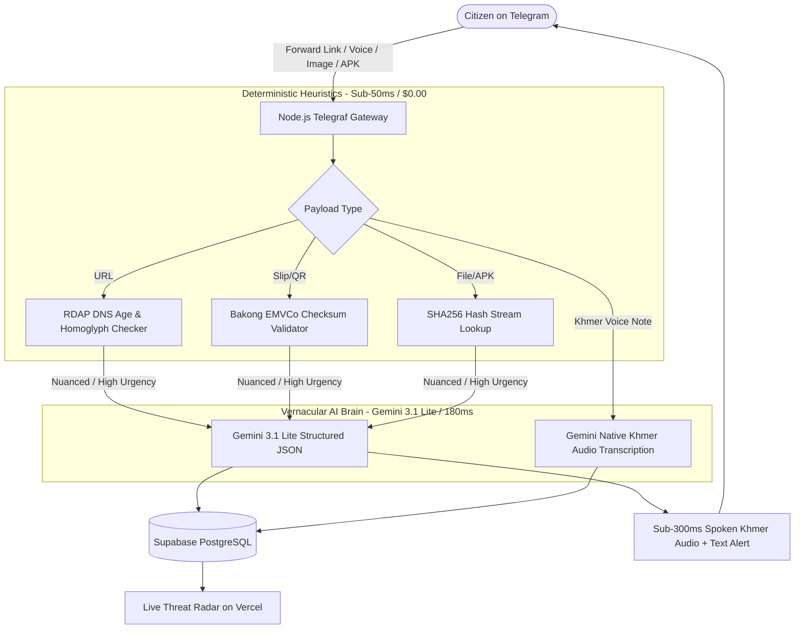
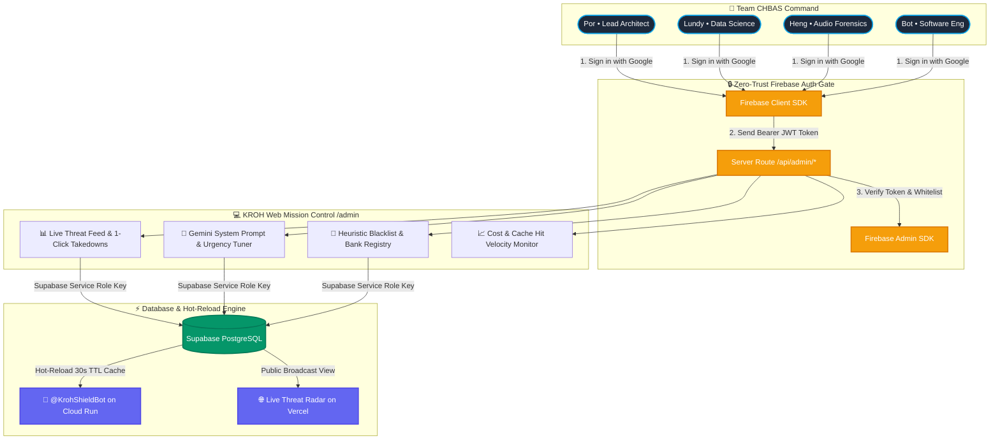

# 🏛️ Technical Architecture: KROH (ក្រោះ)
> **Deterministic Cyber Heuristics + Gemini 3.1 Lite Vernacular AI Engine**  
> **Team:** Team CHBAS (ច្បាស់ ច្បាស់) — AUPP - ITM Innovation Hackathon 2026

---

## 1. High-Level Architecture Diagram

---

## 2. Core Modules & Responsibilities
1. **`src/heuristics/domain_checker.js`**:
   - Queries RDAP protocol. If domain age is $<14\text{ days}$ and brand keyword belongs to ABA/Wing/Bakong $\rightarrow$ flag `HIGH_HAZARD` in 40ms.
2. **`src/heuristics/emvco_khqr.js`**:
   - Parses Bakong KHQR EMVCo payload format and calculates CRC16 checksum.
   - Detects altered QR codes pasted over physical merchant counters.
3. **`src/heuristics/hash_checker.js`**:
   - Streams Telegram file bytes into Node.js `crypto.createHash('sha256')`. Zero file saved to disk.
4. **`src/services/gemini.js`**:
   - Uses `@google/genai` with `gemini-2.5-flash` / `gemini-3.1-lite` at `temperature: 0.1`.
   - Returns strict JSON schema with risk score, category, and colloquial Khmer advice.

---

## 3. Web Admin Mission Control & Firebase Auth Security Boundary

### 3.1 Firebase Authentication & Strict Whitelisting
- **Google Sign-In with Domain & Email Whitelist**: Authentication is handled via Firebase Auth. Only emails explicitly listed in `ADMIN_ALLOWED_EMAILS` are granted administrative authorization.
- **Server-Side Token Verification**: Web API endpoints verify the Bearer token with `firebase-admin` before issuing commands or reading sensitive threat logs.
- **Role-Based Access Control (RBAC)**:
  - `owner` / `superadmin` (Christpor): System prompts, API keys, emergency kill-switch.
  - `analyst` (Lundy, Heng): Review scam audio transcripts, re-classify false positives, export MPTC reports.
  - `engineer` (Bot): Telemetry logs, webhook latency, database connection health.

### 3.2 Zero-Downtime Hot Reloading Architecture
- The Telegram bot core running on Google Cloud Run reads dynamic operational parameters from Supabase table `bot_runtime_config` (system prompts, urgency thresholds, blacklisted phone/bank accounts).
- **30-Second In-Memory Cache TTL**: The bot caches runtime configurations in memory for 30 seconds. When an administrator updates a prompt or adds a new fraudulent ABA bank account on `/admin`, all bot instances automatically sync the update within 30 seconds without restarting or redeploying containers.

### 3.3 1-Click Law Enforcement & MPTC Export
- When an administrator confirms an active zero-day phishing campaign on `/admin`, a single click formats the incident into an MPTC-compliant JSON payload (timestamp, domain registrar, IP host, victim screenshot hash) ready for automated dispatch to the Anti-Cybercrime Department.
