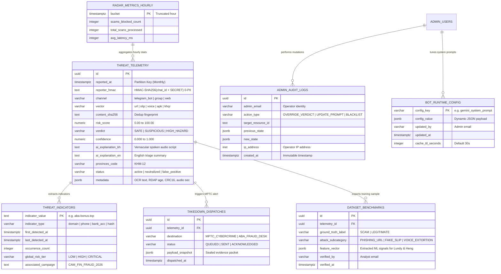

# 🗄️ Entity Relationship Diagram (ERD) & Database Specification
> **System:** KROH (ក្រោះ) — Autonomous Citizen Anti-Scam Shield  
> **Database Engine:** PostgreSQL 15+ (Supabase Managed with PgBouncer)  
> **Standard:** Banking-Grade Zero-PII Cryptographic Anonymity & Append-Only Audit Controls  
> **Team:** Team CHBAS (ច្បាស់ ច្បាស់) • AUPP - ITM Innovation Hackathon 2026

---

## 🗺️ 1. Master Visual Entity Relationship Diagram



---

## 🏛️ 2. Detailed Data Dictionary

### 2.1 Table: `threat_telemetry` (The Ingestion Ledger)
The primary high-throughput event table recording every evaluation performed by KROH.

| Column | Type | Nullable | Default | Constraints / Description |
| :--- | :--- | :--- | :--- | :--- |
| `id` | `UUID` | No | `uuid_generate_v4()` | Primary Key. |
| `reported_at` | `TIMESTAMPTZ` | No | `NOW()` | Timestamp of Telegram message receipt. Used for monthly table partitioning. |
| `reporter_hmac` | `TEXT` | No | — | **Zero-PII Token:** `HMAC-SHA256(telegram_chat_id, TELEGRAM_SALT_SECRET)`. Irreversible without secret. |
| `channel` | `VARCHAR(32)` | No | `'telegram_bot'` | Originating channel: `telegram_bot`, `group_guardian`, `web_radar`. |
| `vector` | `VARCHAR(32)` | No | — | Attack vector: `url`, `receipt_slip`, `voice_note`, `text_message`, `apk_hash`, `khqr`. |
| `raw_content_preview` | `TEXT` | Yes | `NULL` | Truncated, sanitized text snippet ($\le 128$ characters). PII stripped. |
| `content_sha256` | `TEXT` | No | — | Cryptographic hash of normalized payload for sub-10ms dedup checks. |
| `risk_score` | `NUMERIC(5,2)` | No | — | Normalized risk severity: `0.00` (safe) to `100.00` (critical threat). |
| `verdict` | `VARCHAR(24)` | No | — | Categorical classification: `SAFE`, `SUSPICIOUS`, `HIGH_HAZARD`. |
| `confidence` | `NUMERIC(4,3)` | No | `0.950` | Model confidence metric: `0.000` to `1.000`. |
| `ai_explanation_kh` | `TEXT` | No | — | Conversational Khmer voice script sent to citizen via Telegram audio voice note. |
| `ai_explanation_en` | `TEXT` | Yes | `NULL` | Technical English summary for banking analysts and radar HUD. |
| `provinces_code` | `VARCHAR(16)` | Yes | `'KHM-12'` | ISO 3166-2:KH code for geolocation pin on Vercel threat map (Default: Phnom Penh). |
| `status` | `VARCHAR(24)` | No | `'active_threat'` | Lifecycle state: `active_threat`, `neutralized`, `false_positive`. |
| `metadata` | `JSONB` | Yes | `'{}'` | Structured forensic evidence: `{ "domain_age_days": 3, "emvco_valid": false, "audio_duration_sec": 12 }`. |

---

### 2.2 Table: `threat_indicators` (Sub-50ms Heuristic Blacklist)
In-memory and cached lookup table for known malicious indicators.

| Column | Type | Nullable | Default | Description |
| :--- | :--- | :--- | :--- | :--- |
| `indicator_value` | `TEXT` | No | — | **Primary Key:** Cleaned string (e.g. `aba-bonus.top`, `012345678`, `a6f5e2...`). |
| `indicator_type` | `VARCHAR(24)` | No | — | Type: `domain`, `phone_number`, `bank_account`, `telegram_handle`, `sha256_hash`. |
| `first_detected_at` | `TIMESTAMPTZ` | No | `NOW()` | Timestamp indicator was first confirmed in Cambodia. |
| `last_detected_at` | `TIMESTAMPTZ` | No | `NOW()` | Latest observation across any Telegram group or bot scan. |
| `occurrence_count` | `INTEGER` | No | `1` | Hit velocity counter (increments on every match). |
| `global_risk_tier` | `VARCHAR(16)` | No | `'HIGH'` | Tier: `LOW`, `MEDIUM`, `HIGH`, `CRITICAL`. |
| `associated_campaign` | `TEXT` | Yes | `'CAM_FIN_FRAUD_2026'` | Campaign attribution tag for banking feeds. |

---

### 2.3 Table: `bot_runtime_config` (30-Second TTL Hot Reload)
Stores runtime parameters that the Cloud Run bot fetches and caches in RAM for 30 seconds.

| Column | Type | Nullable | Default | Description |
| :--- | :--- | :--- | :--- | :--- |
| `config_key` | `VARCHAR(64)` | No | — | **Primary Key:** Identifier (e.g. `gemini_system_prompt`, `urgency_threshold`). |
| `config_value` | `JSONB` | No | — | Active runtime JSON configuration payload. |
| `updated_by` | `VARCHAR(128)` | No | — | Email of the admin who made the adjustment. |
| `updated_at` | `TIMESTAMPTZ` | No | `NOW()` | Last modification timestamp. |
| `cache_ttl_seconds` | `INTEGER` | No | `30` | Recommended in-memory caching duration for Cloud Run instances. |

---

### 2.4 Table: `admin_audit_logs` (Append-Only Zero-Trust Ledger)
Records every single administrative mutation for compliance, transparency, and accountability.

| Column | Type | Nullable | Default | Description |
| :--- | :--- | :--- | :--- | :--- |
| `id` | `UUID` | No | `uuid_generate_v4()` | Primary Key. |
| `admin_email` | `VARCHAR(128)` | No | — | Operator Google email authenticated via Firebase Auth. |
| `action_type` | `VARCHAR(48)` | No | — | Event: `OVERRIDE_VERDICT`, `UPDATE_PROMPT`, `ADD_BLACKLIST`, `EXPORT_MPTC`. |
| `target_resource_id` | `TEXT` | Yes | `NULL` | ID or key of modified record. |
| `previous_state` | `JSONB` | Yes | `NULL` | Snapshot of state prior to change. |
| `new_state` | `JSONB` | Yes | `NULL` | Snapshot of state after change. |
| `ip_address` | `INET` | Yes | `NULL` | Operator remote IP address. |
| `created_at` | `TIMESTAMPTZ` | No | `NOW()` | **Immutable timestamp.** Cannot be edited or deleted. |

---

### 2.5 Table: `dataset_benchmarks` (Data Science & ML Training Hub)
Dedicated workspace table designed for **Lundy (Data Science Lead)** and **Heng (Audio & Forensics Lead)** to benchmark Gemini 3.1 Lite accuracy and export verified training samples.

| Column | Type | Nullable | Default | Description |
| :--- | :--- | :--- | :--- | :--- |
| `id` | `UUID` | No | `uuid_generate_v4()` | Primary Key. |
| `telemetry_id` | `UUID` | No | — | Foreign Key referencing `threat_telemetry(id)`. |
| `ground_truth_label` | `VARCHAR(24)` | No | — | Ground truth verified by human analyst: `SCAM` or `LEGITIMATE`. |
| `attack_subcategory` | `VARCHAR(48)` | No | — | Sub-vector: `PHISHING_URL`, `FAKE_ABA_SLIP`, `VOICE_EXTORTION`, `MALICIOUS_APK`. |
| `feature_vector` | `JSONB` | No | `'{}'` | Normalized signals for ML training (e.g. OCR token count, CRC16 validity, pitch variance). |
| `verified_by` | `VARCHAR(128)` | No | — | Analyst email who audited the sample. |
| `verified_at` | `TIMESTAMPTZ` | No | `NOW()` | Verification timestamp. |

---

### 2.6 Table: `takedown_dispatches` (Law Enforcement Integration)
Audit log of incident reports dispatched to the Ministry of Post and Telecom (MPTC) Anti-Cybercrime Department.

| Column | Type | Nullable | Default | Description |
| :--- | :--- | :--- | :--- | :--- |
| `id` | `UUID` | No | `uuid_generate_v4()` | Primary Key. |
| `telemetry_id` | `UUID` | No | — | Foreign Key referencing `threat_telemetry(id)`. |
| `destination` | `VARCHAR(48)` | No | `'MPTC_CYBERCRIME'` | Target endpoint: `MPTC_CYBERCRIME`, `ABA_FRAUD_DESK`, `WING_SECURITY`. |
| `status` | `VARCHAR(24)` | No | `'QUEUED'` | Delivery state: `QUEUED`, `SENT`, `ACKNOWLEDGED`, `REJECTED`. |
| `payload_snapshot` | `JSONB` | No | — | Sealed JSON evidence bundle containing registrar, IP host, and screenshot hash. |
| `dispatched_at` | `TIMESTAMPTZ` | No | `NOW()` | Dispatch timestamp. |

---

### 2.7 Table: `radar_metrics_hourly` (Time-Series Aggregations)
Pre-aggregated rollups allowing the public Vercel live map to render instantaneous telemetry in <5ms.

| Column | Type | Nullable | Default | Description |
| :--- | :--- | :--- | :--- | :--- |
| `bucket` | `TIMESTAMPTZ` | No | — | **Primary Key:** Start of hour (`date_trunc('hour', reported_at)`). |
| `scams_blocked_count`| `INTEGER` | No | `0` | Number of malicious attacks intercepted during the hour. |
| `total_scans_processed`| `INTEGER` | No | `0` | Total queries processed through bot and radar. |
| `avg_latency_ms` | `INTEGER` | No | `210` | Average end-to-end processing latency. |

---

## 🔒 3. Defensive Cybersecurity Architecture (Manus-Cyber Model)

### 3.1 Cryptographic Salted Pseudonymization (0-PII Guarantee)
* **The Vulnerability:** Storing raw `chat_id` or simple `SHA256(chat_id)` exposes citizen identities to offline rainbow table reversal because Telegram numeric IDs are small 9-to-10 digit numbers.
* **The KROH Defense:** All user identifiers are hashed using **HMAC-SHA256** with an isolated server-side salt:
  ```
  reporter_hmac = HMAC_SHA256(telegram_chat_id, TELEGRAM_SALT_SECRET)
  ```
* Even under full database compromise, user identities cannot be reversed without the physical GCP Secret Manager key.

### 3.2 Append-Only Database Security
To prevent insider threats or compromised admin credentials from erasing forensic trails, PostgreSQL strictly blocks deletions on audit logs:
```sql
REVOKE UPDATE, DELETE, TRUNCATE ON public.admin_audit_logs FROM public, authenticated, anon;
```

### 3.3 Row-Level Security (RLS) & Public Data Sanitization
Public radar users only query the sanitized view `public_threat_feed`, which strips all hashes, metadata, and internal operator tags:
```sql
CREATE OR REPLACE VIEW public.public_threat_feed AS
SELECT id, reported_at, vector, risk_score, verdict, ai_explanation_kh, provinces_code, status
FROM public.threat_telemetry
WHERE status = 'active_threat'
ORDER BY reported_at DESC;
```

---

## ⚡ 4. High-Performance Indexing Strategy

| Index Name | Target Table | Type | Purpose |
| :--- | :--- | :--- | :--- |
| `idx_threat_telemetry_reported_at` | `threat_telemetry(reported_at DESC)` | B-Tree | Powers sub-10ms chronological feed for live radar. |
| `idx_threat_telemetry_sha256` | `threat_telemetry(content_sha256)` | B-Tree | Enables sub-5ms deduplication lookups for viral scams. |
| `idx_threat_telemetry_metadata_gin` | `threat_telemetry USING GIN(metadata)` | GIN | Accelerates JSONB deep queries (e.g. finding all scams mentioning "ABA"). |
| `idx_threat_indicators_type` | `threat_indicators(indicator_type)` | B-Tree | Rapid heuristic filtering by domain or bank account. |
| `idx_dataset_benchmarks_label` | `dataset_benchmarks(ground_truth_label)` | B-Tree | Fast batch export for Lundy & Heng ML evaluation scripts. |
